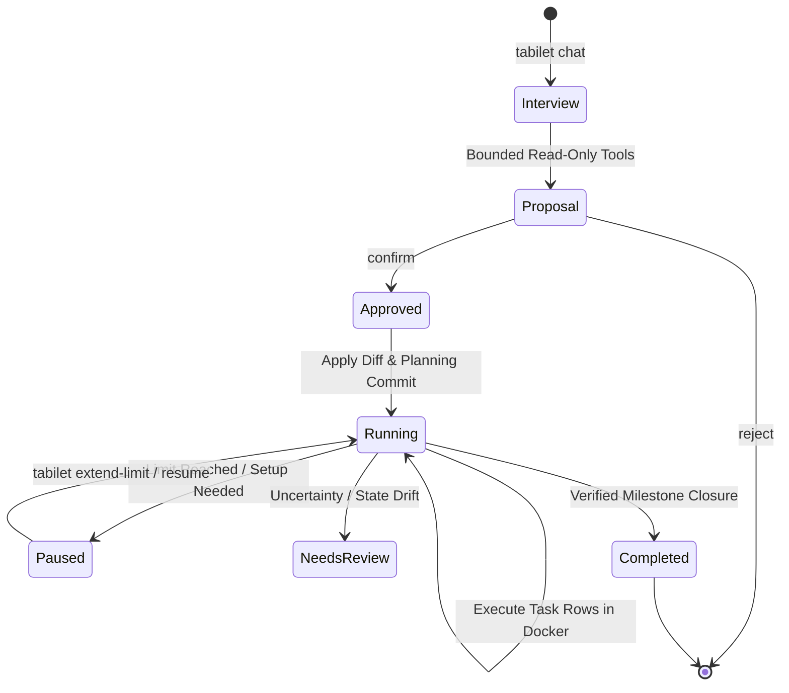

# Tabilet API Controller Architecture and Receipt Specification

Status: Completed and released in v2.2.0. This document consolidates the original
controller architecture plans, design drafts, and milestone records (formerly
`api-automation-1.md` through `api-automation-8.md`) into a single permanent technical
specification for the optional account-level `tabilet` controller.

For user-facing CLI guidance, see [Tabilet API controller](tabilet-controller.md).
For standalone API runner documentation and shared exit codes, see [EXECUTION.md](EXECUTION.md).

---

## 1. Architectural Model and Boundaries

The `tabilet` controller provides an optional account-level conversation and
execution harness for Tabilet memory-bank projects. It plans a bounded
milestone horizon, presents a visible diff, asks for one human confirmation,
and executes approved tasks in local Docker containers.

### Core Boundaries (per [AGENTS.md](../AGENTS.md))
- **Account-Level Payload**: Installed into `~/.local/bin/tabilet` and
  `~/.local/lib/tabilet/controller` via `harness/tabilet_install.py`. It adds no
  files to target projects except git commits authorized by the user.
- **Dependency-Free Host**: Uses Python's standard library, Git, and Docker. Adds
  no background daemon, database service, or provider SDKs.
- **Markdown is Task Truth**: The project's Markdown memory bank remains the sole
  authoritative source for milestones, tasks, architecture, and lessons. The
  controller maintains no private task ledger.
- **Single Execution Horizon**: One human confirmation authorizes the exact displayed
  planning diff and one bounded, local execution horizon (the smallest dependency-closed
  set of milestones reaching the next verifiable delivery outcome).
- **Verified Automatic Closure**: Verified milestone closure reports completion
  automatically; there is no final `accept` or `reject` command.

---

## 2. Receipt Schema (`tabilet.api.receipt/v1`)

The controller receipt is private state stored outside the project that records
the exact scope of human authorization, resource caps, and verified checkpoints.

| Field | Type | Meaning |
|---|---|---|
| `schema` | string | Literal `tabilet.api.receipt/v1`. |
| `receipt_id` | UUID string | Unique receipt identity. |
| `project_path` | absolute canonical path string | Bound project root. |
| `proposal_sha256`, `diff_sha256` | 64-character lowercase hex strings | Exact rendered proposal and approved patch digests. |
| `approved_diff` | UTF-8 string | Exact patch needed to apply or reconcile the approved planning change. |
| `horizon_ids` | array of strings | Permanent milestone IDs in this approval. |
| `approved_horizon` | array of milestone objects | Exact approved task descriptions, milestone and task acceptance criteria, dependencies, verification commands, task `approved_paths`, milestone `closure_paths`, and declared manual evidence for execution. |
| `external_actions` | array | Actions reported by planning; none are authorized by the general confirmation. |
| `file_actions` | array of objects | Each item has a project-relative `path` string and an `action` enum of `create`, `replace`, or `delete`. |
| `branch` | string or null | Expected branch name; null for a detached or unborn `HEAD`. |
| `baseline_commit`, `planning_commit` | Git object ID string or null | Approved pre-plan HEAD and resulting planning commit. |
| `planning_state_sha256` | 64-character lowercase hex string | Digest of active and retired workflow file hashes and permanent IDs at approval. |
| `result_state_sha256` | 64-character lowercase hex string or null | Expected active and retired workflow state after the approved planning diff is applied. Initially null; persisted before the planning commit so crash recovery can detect ignored-file or ID drift. |
| `result_action_sha256` | object mapping approved project-relative paths to a lowercase SHA-256 string or null | Expected hash or absence of each approved file after patch application. Initially null; persisted before commit to detect worktree drift in every changed path. |
| `image_id` | immutable Docker image ID string | Executor image pinned by the proposal. |
| `limits` | object of positive integers | `max_rows`, `max_provider_attempts`, `max_turns_per_row`, `max_commits`, `max_runtime_seconds`; defaults are 5, 100, 40, 15, and 7200. |
| `approved_at` | RFC 3339 UTC timestamp string | Start of the two-hour elapsed-time limit. |
| `usage` | object | Nonnegative integer `rows_started`, `provider_attempts_reserved`, `commits_reserved`, and `commits_recorded` counters; unique `rows_started_ids`; plus `turns_by_row`, a map from row or closure-ID strings to nonnegative integer counters. `commits_reserved` starts at 1 for the receipt-created planning commit and increases durably before each later commit attempt; `commits_recorded` counts verified commits. |
| `closure` | object | Per-milestone phase checkpoints, bounded review-iteration count, and evidence with its source. |
| `verification_evidence` | array | Required task-check commands, exit results, and bounded output captured before each host commit. |
| `commit_ids` | array of Git object ID strings | Planning, task, and closure commits proven and recorded. |
| `limit_extensions` | array | Confirmed cap increases, each with the limit name, old and new value, proposal digest, clean checkpoint `HEAD`, and confirmation timestamp. |
| `active_operation` | object or null | `kind` and stable `operation_id` strings; `phase` enum `prepared`, `provider_dispatched`, `result_recorded`, `precommit_verified`, or `commit_attempted`; `expected_head` Git object ID or null; `row_id`, `milestone_id`, and `closure_phase` strings or null; and `paths`, an array of project-relative strings. Persist `prepared` before dispatch, then atomically record each phase before its corresponding action. `result_recorded` is used only for a verified closure result and lets recovery advance a clean no-change phase without repeating its model call. |
| `mutation_scope` | string | Literal `local_only`; external actions are excluded. |
| `pause_reason` | string or null | Human-readable reason for `paused` or `needs_review`. |
| `state` | string enum | `approved`, `running`, `paused`, `needs_review`, or `completed`. |

First create an `approved` receipt durably before applying the plan. Update it
atomically when recording operation intent, reserving a provider attempt, or
advancing a verified checkpoint. `approved` means the plan is authorized but
not yet committed; `running` means the planning commit is recorded; `paused`
means a clean checkpoint awaits setup, evidence, limit extension, or separate
handling; `needs_review` means provenance or filesystem state is uncertain and
forbids automatic replay; `completed` is terminal and follows verified closure.
There is no `awaiting_acceptance` state or final horizon accept/reject command.
`reject` applies only to a planning proposal before confirmation. The receipt is
execution authority; Markdown stays task truth.

---

## 3. Limits and Docker Sandbox Isolation

### Operational Limits
The suggested default caps configured during planning are:
- `max_rows`: 5 task rows
- `max_provider_attempts`: 100 model calls (including retries and failed parses)
- `max_turns_per_row`: 40 model turns per status row
- `max_commits`: 15 total commits (planning commit, task commits, review fixes, closure commits)
- `max_runtime_seconds`: 7,200 seconds (2 hours elapsed time)

Reaching any limit pauses execution cleanly with exit code `16`. Limits can be
extended only via `tabilet extend-limit`, which requires an exact `confirm` of
a strictly higher value at a clean, receipt-proved paused checkpoint.

### Docker Sandbox Parameters
Execution occurs inside a local Docker container pinned by immutable image ID:
- **CPU Limit**: 4 CPUs (`--cpus=4`)
- **Memory Limit**: 8 GiB (`--memory=8g`)
- **Process Limit**: 512 processes (`--pids-limit=512`)
- **Execution Timeout**: 300 seconds per command invocation
- **Filesystem Isolation**: The target project is mounted read-write, while `.git`
  is mounted read-only to prevent unauthorized repository tampering.

---

## 4. Exit Codes

Controller exit codes are defined in [EXECUTION.md](EXECUTION.md#exit-codes)
and coordinated with the standalone runner:

| Code | Meaning |
|---|---|
| `0` | Command completed; for execution, required closure verified and the horizon completed. |
| `2` | Usage or configuration error. |
| `16` | Paused on a receipt limit. |
| `17` | Paused for setup, required manual evidence, or a separately handled external action. |
| `18` | Approval is stale: branch, lineage, hashes, or IDs drifted since `confirm`. |
| `19` | Another Tabilet launcher holds the shared project lock. |
| `24` | Controller pre-commit row or verification gate failed; no host task commit was made. |
| `25` | Dirty or uncertain recovery requires manual review; no automatic replay. |

Codes `20` and `21` are reserved exclusively for the standalone API runner's
HTTP provider failure and network timeout conditions.

---

## 5. Planning and Execution Lifecycle

1. **Interview (`tabilet chat`)**: Gathers user intent using read-only inspection tools
   (no shell execution or project writes permitted prior to confirmation).
2. **Proposal & Diff**: Renders a complete Markdown plan, file action list, and
   unified diff. The human approves via `confirm` or requests adjustments via `reject`.
3. **Execution Horizon**: The approved horizon executes serially. Each task row is
   implemented in Docker, verified against declared tests, verified on the host,
   and committed individually.
4. **Milestone Review & Closure**: Upon the last row in each milestone, the controller
   executes the bounded review gate (up to 10 iterations), reconciles downstream
   milestones, and executes retirement into `tabilet/docs/history/`.

---

## 6. Historical Milestone Lineage

The controller implementation was completed and verified across eight milestones:

| Milestone | Scope | Deliverables |
|---|---|---|
| **API 1** | Boundary amendment, receipt schema, exit codes | `AGENTS.md`, `check.py`, receipt schema table |
| **API 2** | Shared execution core, project lock | `harness/tabilet_common.py`, lock protocol |
| **API 3** | Docker sandbox runner, resource limits | `harness/tabilet_docker.py`, bind mount isolation |
| **API 4** | Read-only planning tools, interview engine | `harness/tabilet_plan.py`, safe inspection |
| **API 5** | Proposal generation, receipt signing, planning commit | `harness/tabilet_proposal.py`, diff application |
| **API 6** | Horizon execution loop, automatic closure | `harness/tabilet_exec.py`, task lifecycle |
| **API 7** | Status, resume, recovery, operator controls | `tabilet status`, `tabilet resume` |
| **API 8** | Integration tests, installer, packaging | `harness/tabilet_install.py`, regression suites |
