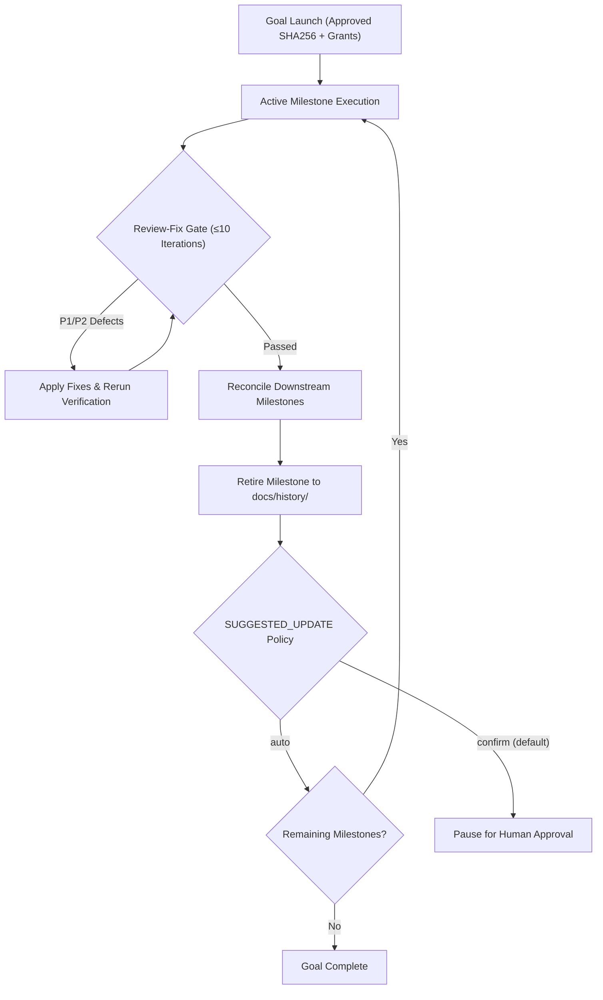

# Autonomous Goal Execution and Authorization Boundaries

This guide describes how to achieve end-to-end autonomous execution across
multiple milestones under the [GOAL.md](../GOAL.md) protocol, and defines the
deliberate safety boundaries where human intervention remains strictly enforced.

---

## 1. The Autonomous Execution Model

Under `GOAL.md`, an orchestrating agent (such as `agy`, Claude Code, or Codex) can
theoretically execute an entire multi-milestone project roadmap from beginning
to end without intermediate human pauses, provided that required permissions
have been pre-authorized and policy configurations allow autonomous progression.

The execution engine sequences milestones, resolves dependencies, dispatches
isolated worker agents (sequentially under Tier 0 or concurrently via external
worktree leases under Tier 1), enforces review gates, and retires completed
milestones into long-term history automatically.



---

## 2. Configuration for Maximum Autonomy

To enable zero-touch execution across milestone boundaries, three configuration
mechanisms must be established at launch:

### A. Autonomous Launch Reference Refresh (`SUGGESTED_UPDATE: auto`)

By default, `SUGGESTED_UPDATE: confirm` pauses execution whenever
`suggested.txt` changes (such as when a milestone closes, prunes completed rows,
and advances to the next milestone), requiring the human to approve the updated
SHA256 checksum before proceeding.

Setting `SUGGESTED_UPDATE: auto` explicitly authorizes the orchestrator to:
- Prune completed milestones upon verified closure;
- Recompute downstream dependency order;
- Activate triggered conditional (`?`) milestones within the approved horizon;
- Smoothly continue execution without pausing for human re-confirmation.

```yaml
COMMIT_POLICY: task
SUGGESTED_UPDATE: auto
EXTERNAL_MUTATIONS: none
AUTHORIZATION_GRANTS: {}
```

> [!IMPORTANT]
> `SUGGESTED_UPDATE: auto` is strictly bounded to refreshing milestone state
> within the approved active delivery horizon. It cannot promote unapproved
> grants, add external commands, or expand scope outside the approved horizon.

### B. High-Level Ambient Authority (`GLOBAL:` Grants)

Rather than declaring identical grants repeatedly for each milestone, high-level
`GLOBAL:` grants apply ambient authority across all tasks and milestones in the
goal:

```yaml
AUTHORIZATION_GRANTS:
  GLOBAL:
    - [~] grant_id: global-local-test
      action: cli.local
      executor: assigned-agent
      scope:
        task: declared-implementation-and-verification
    - [+] grant_id: global-git-push
      action: git.push
      executor: coordinator
      scope:
        repository: /workspace/project
        remote: https://github.com/example/project.git
        ref: refs/heads/main
        mode: fast-forward
```

Child workers inherit matching `GLOBAL:` grants narrowed to their assigned
milestone, eliminating authorization pauses during worker dispatch.

### C. Approved Decision Markers (`[+]` and `[~]`)

Grants proposed in launch references use checkbox decision markers:
- `[+]` (**Approve**): Explicitly activated for execution upon matching checksum verification.
- `[~]` (**Auto**): Pre-approved operations covered by governing goal policy (e.g. declared local verification and task commits).
- `[ ]` (**Need authorization**): Unapproved grants that will pause execution for runtime confirmation if encountered.
- `[-]` (**Deny**): Explicitly forbidden actions.

Ensuring all required grants are marked `[+]` or `[~]` prevents runtime prompts.

---

## 3. Strict Human-in-the-Loop Boundaries

Even when full ambient authority and `SUGGESTED_UPDATE: auto` are granted, the
protocol enforces non-bypassable safety circuits that will pause execution:

### 1. Forced Human Actions & Credentials
- **Secrets & Passwords**: The protocol strictly forbids hardcoding passwords,
  API tokens, or private SSH keys into grant scopes or prompts. Actions
  requiring real-time secret entry must pause for human input.
- **Interactive Browser Operations**: Two-factor authentication (MFA/2FA),
  CAPTCHAs, hardware security keys, or interactive login forms require direct
  human presence.
- **External Real-World Commitments**: Payment authorizations, production
  deployments with external consequences, or legal terms agreement.

### 2. Bounded Milestone Review Gate (10-Iteration Limit)
- When a milestone completes implementation, it must pass a rigorous
  verification and multi-perspective review gate.
- If defects classified as **P1** (blocking acceptance/integrity) or **P2**
  (material defect in supported behavior) are found, the agent must fix them
  and re-verify.
- If iteration 10 still contains P1/P2 issues, the gate **fails permanently**.
  The milestone is marked `[!]` (blocked), downstream reconciliation is halted,
  and the agent must stop for human direction rather than looping indefinitely.

### 3. Product and Design Ambiguity
- When downstream reconciliation discovers an architectural contradiction,
  conflicting invariants, or missing requirements that cannot be resolved from
  existing project documentation, the agent is forbidden from guessing or
  silently expanding product boundaries. It must halt and ask for guidance.

### 4. Integration Conflicts in Parallel Leases (Tier 1)
- Under Tier 1 parallel execution, concurrent milestone leases execute in
  isolated external worktrees (`../<repo>.goal/<ID>`) and integrate via linear
  rebase and fast-forward (`git merge --ff-only`).
- If an integration branch encounters a git rebase conflict that cannot be
  cleanly and deterministically resolved, the orchestrator stops immediately
  to prevent repository corruption.

### 5. Controller Caps (when running via `tabilet`)
- If using the optional `tabilet` execution controller, hard resource caps
  (e.g., maximum 5 status rows, 40 turns per row, 15 commits, or 2 hours)
  automatically pause execution at a clean checkpoint to prevent runaway spend
  or infinite loops. Extending limits requires an explicit human `confirm`.

---

## 4. Complete End-to-End Autonomous Launch Template

Below is a complete, copyable launch input block demonstrating full end-to-end
autonomy for a multi-milestone goal:

```markdown
Run milestones M01, M02, and M03 to completion under GOAL.md:

COMMIT_POLICY: task
INTEGRATION: local-rebase-ff
SUGGESTED_UPDATE: auto
EXTERNAL_MUTATIONS: none
AUTHORIZATION_GRANTS:
  GLOBAL:
    - [~] grant_id: global-local-verify
      action: cli.local
      executor: assigned-agent
      scope:
        task: declared-implementation-and-verification
    - [~] grant_id: global-repo-push
      action: git.push
      executor: coordinator
      scope:
        repository: /workspace/my-project
        remote: https://github.com/my-org/my-project.git
        ref: refs/heads/main
        mode: fast-forward
```

With this block approved:
1. The orchestrator runs milestone `M01`, commits each task under `COMMIT_POLICY: task`, passes the review gate, and retires `M01` to `docs/history/`.
2. Because `SUGGESTED_UPDATE: auto` is set, `suggested.txt` is updated to reflect `M02` and `M03` remaining, without prompting the user.
3. The orchestrator immediately begins `M02`, inheriting the `GLOBAL:` verification and push grants.
4. Execution proceeds seamlessly until all milestones are retired or a true safety boundary is encountered.
