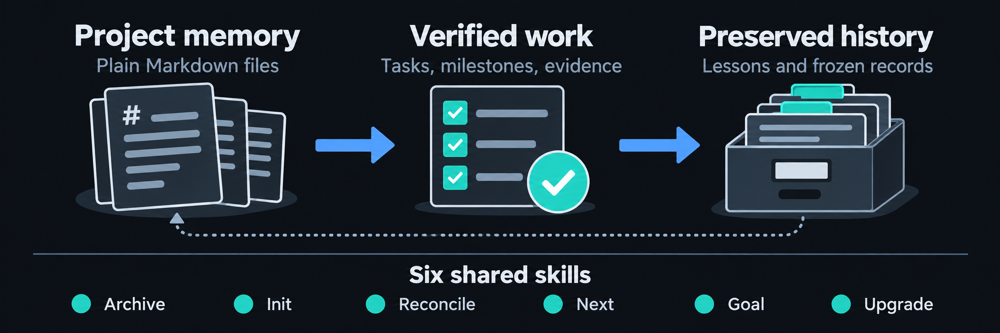

# Memory Bank

<p class="memory-bank-hero" align="center">
  <a href="assets/memory-bank-infographic.png" title="Open the full-size Memory Bank infographic">
    
  </a>
</p>

Keep your project's decisions, tasks, and verification evidence in plain
Markdown. **Memory Bank** gives coding agents a shared record of what the
project is, what has been done, and what should happen next—even when you start
a new session or switch agents.

Use the same project files with **Claude Code, Codex, or DeepSeek Harness
(DSH)**. Seven optional skills help create and maintain them. The files stay in
your repository and remain usable without the skills. Version 2.0.0 keeps
project-owned Memory Bank files under `tabilet/`.

[Install the skills](installation.md){ .md-button .md-button--primary }
[Start your first project](examples.md#a-new-project){ .md-button }

> The agent brings the capability. The project brings the memory.

## Choose your starting point

| Your project today | Start here |
|---|---|
| New, or an existing codebase without a memory bank | [Init](init.md) inspects the project, asks about decisions, and proposes a plan. A broad codebase may need [Archive](archive.md) first. |
| Already has approved tasks | [Next](next.md) handles one task; [Goal](goal.md) handles an explicit milestone order. |
| Has a requested feature or candidate promotion | [Propose](propose.md) inspects the current plan and presents one planning proposal. |
| Has a new engineering review | [Reconcile](reconcile.md) checks the findings and proposes planning changes. |
| Has v1.5.0 files at the project root | [Migrate to v2](upgrade.md#migrate-a-v150-project-to-v2) before running v2 workflows. |
| Uses an older workflow contract after migration | [Upgrade](upgrade.md) proposes rule changes while preserving tasks and history. |

These are entry points, not a sequence every project must follow. See
[worked examples](examples.md) for how they fit together.

## What stays in your project

```text
your-project/
├── AGENTS.md                 what an agent reads first
├── docs/                     other project documentation
└── tabilet/
    ├── GOAL.md               optional multi-milestone protocol
    ├── memory-bank/
    │   ├── product.md         what this is, and is not
    │   ├── architecture.md    layout, data flow, boundaries
    │   ├── tech-stack.md      commands, dependencies, verification
    │   ├── lessons.md         learning that still applies
    │   ├── milestone.md       active milestones and acceptance
    │   └── status-M01.md      one file per active milestone
    ├── docs/history/          retired records; created when first needed
    └── evolution/             versioned direction snapshots
```

`AGENTS.md` tells an agent where to start. The memory bank holds current facts
and the active plan. History preserves evidence for later questions, and
`tabilet/evolution/` records changes in direction. Status IDs remain permanent across
active and retired storage.

Reading and maintaining these files needs no Memory Bank runtime. Git is needed
for the usual per-task commit workflow. Python is needed for the optional
[API runner](installation.md#the-optional-api-harness) and one-time migration; your existing agent can work
with the files directly.

## The seven skills

| Skill | When you reach for it |
|---|---|
| [Archive](archive.md) | A broad existing package needs a commit-anchored map of what is already there. |
| [Init](init.md) | A project has no milestone and status harness yet. |
| [Propose](propose.md) | A requested feature, candidate promotion, or future direction change needs approved planning. |
| [Reconcile](reconcile.md) | A new code, architecture, or security review arrives. |
| [Next](next.md) | Implement or resume one task, verify it, and commit under the governing policy. |
| [Goal](goal.md) | Execute ordered milestones with an explicit commit policy and completion condition. |
| [Upgrade](upgrade.md) | You installed newer skills and want to adopt their rules safely. |

**Init, Archive, Propose, Reconcile, and Upgrade** present a complete proposal for approval
before writing. **Next and Goal** execute work you have authorized; they can
change code, update records, and make commits under the applicable policy.
Installing a skill does not authorize work or migrate an existing project.

## Long-lived memory

In projects that have adopted the retirement rules, a milestone's complete
specification and status document retire into
`tabilet/docs/history/status-<LANE><NN>.md`. The identifier stays reserved, the record
freezes, and the active plan stops carrying it. Retirement follows verification,
the bounded review gate, knowledge consolidation, and downstream reconciliation.
Completed task markers alone do not prove milestone acceptance.

What remains close to the next task is `lessons.md`: curated learning with
evidence, such as a failure mode whose cause was easy to miss. Superseded
knowledge is preserved in an append-only journal rather than overwritten.

This memory survives a chat reset, an agent switch, or the end of a
subscription, because it belongs to the repository rather than to a vendor.

## A dashboard for DSH

The optional [tabilet-skills companion](installation.md#deepseek-harness)
adds a **Memory Bank** sidebar to DSH. Browse tasks, memory, recorded acceptance
evidence, and history for the selected project, then prepare a skill request in
the existing conversation. You review and send it yourself.

The dashboard reads your project files. It does not maintain a second task list
or mark work complete. Installing the companion in a headless profile exposes
all seven v2.0.0 skills without the Web interface.
